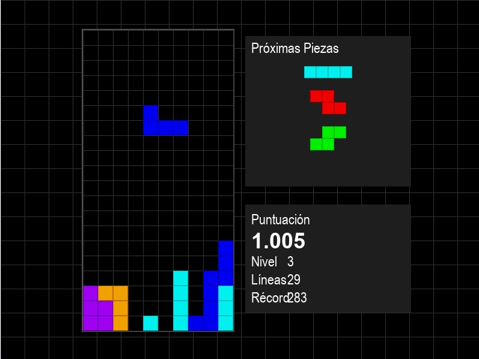

# Tetris

> **Aviso:** Este juego solo es compatible y ha sido probado en Windows.
Más información **abajo**


Un juego clásico de Tetris implementado en Python usando Pygame, con una arquitectura modular y características modernas.



## Descripción

Esta implementación del clásico juego Tetris incluye todas las funcionalidades originales, como las siete piezas estándar, sistema de rotación, incremento de dificultad por niveles y puntuación. Además, incorpora funciones adicionales como previsualización de próximas piezas, guardado de récords y una interfaz de usuario intuitiva.
Versión 1.0 del juego

## Requisitos del Sistema

- Python 3.7 o superior
- Sistema operativo: Windows
- Espacio en disco: ~50MB
- Memoria RAM: 100MB o más (la que usa el SO no se incluye)

## Instalación

1. Clona o descarga este repositorio.

2. Asegúrate de tener Python instalado en tu sistema o descargaló en releases.

3. Crea un entorno virtual (opcional pero recomendado):
   ```
   python -m venv venv
   ```

5. Activa el entorno virtual:
    ```
    .\venv\Scripts\activate
    ```

6. Instala las dependencias:
   ```
   pip install -r requirements.txt
   ```

## Cómo Jugar

Para iniciar el juego, ejecuta:
```
python main.py
```

### Controles

- **Flechas izquierda/derecha**: Mover pieza horizontalmente
- **Flecha arriba**: Rotar pieza
- **Flecha abajo**: Soft drop (caída acelerada)
- **Espacio**: Hard drop (caída instantánea)
- **P**: Pausar juego
- **ESC**: Volver al menú principal

## Características Principales

- **7 Piezas Clásicas**: I, O, T, S, Z, J, L con sus rotaciones correspondientes
- **Previsualización**: Muestra las siguientes 3 piezas
- **Sistema de Puntuación**:
  - Puntos por pieza colocada
  - Bonificación por líneas eliminadas (especialmente por Tetris - 4 líneas)
  - Puntos extra por hard drop
- **Dificultad Progresiva**: La velocidad aumenta con cada nivel
- **Récords**: Almacena las mejores puntuaciones con nombre del jugador
- **Interfaz Moderna**: Menús intuitivos y diseño visual atractivo

## Estructura del Proyecto

El juego está estructurado de forma modular para facilitar su mantenimiento y extensibilidad:

- **main.py**: Punto de entrada y bucle principal del juego
- **board.py**: Lógica del tablero y gestión de colisiones
- **pieces.py**: Definición y comportamiento de las piezas
- **score.py**: Sistema de puntuación y récords
- **ui.py**: Interfaz gráfica
- **constants.py**: Configuraciones y constantes


## Licencia

Este proyecto está disponible bajo la **Simplified Open License (SOL) versión 1.0**.

Esta licencia permite:
- Uso libre del software para cualquier propósito, incluyendo comercial
- Modificación y distribución del código
- Creación de trabajos derivados sin obligación de hacerlos open source

Con la única condición de mantener la atribución al autor original.

Para más detalles, consulta el archivo [LICENSE](LICENSE) incluido en este repositorio.

## Porque solo es para Windows:

- **Solo es para Windows** porque los drivers que están en el codigó estan hechos asin paramayor funcionalidad
