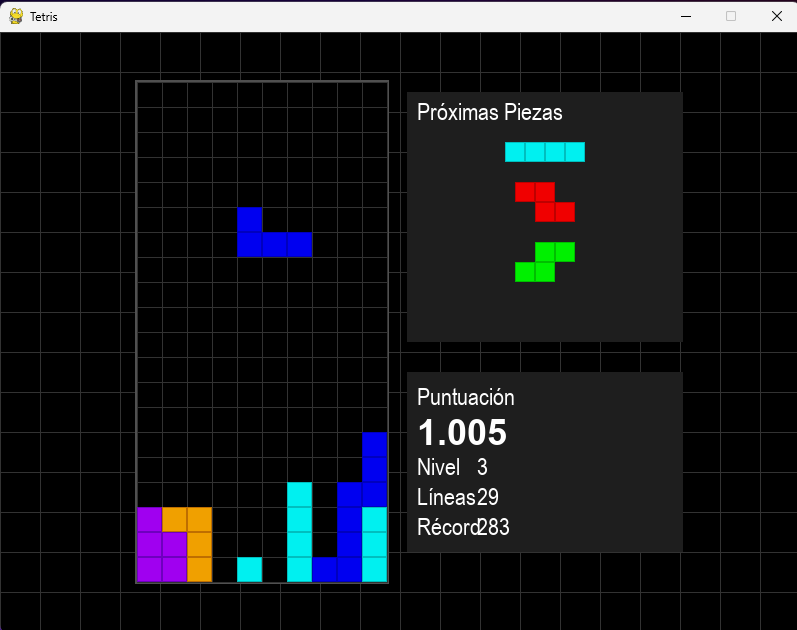

# Tetris

Un juego clásico de Tetris implementado en Python usando Pygame, con una arquitectura modular y características modernas.



## Descripción

Esta implementación del clásico juego Tetris incluye todas las funcionalidades originales, como las siete piezas estándar, sistema de rotación, incremento de dificultad por niveles y puntuación. Además, incorpora funciones adicionales como previsualización de próximas piezas, guardado de récords y una interfaz de usuario intuitiva.

## Requisitos del Sistema

- Python 3.7 o superior
- Sistema operativo: Windows, macOS o Linux
- Espacio en disco: ~10MB
- Memoria RAM: 100MB o más

## Instalación

1. Clona o descarga este repositorio.
2. Asegúrate de tener Python instalado en tu sistema.
3. Crea un entorno virtual (opcional pero recomendado):
   ```
   python -m venv venv
   ```
4. Activa el entorno virtual:
   - En Windows:
     ```
     .\venv\Scripts\activate
     ```
   - En macOS/Linux:
     ```
     source venv/bin/activate
     ```
5. Instala las dependencias:
   ```
   pip install -r requirements.txt
   ```

## Cómo Jugar

Para iniciar el juego, ejecuta:
```
python main.py
```

### Controles

- **Flechas izquierda/derecha**: Mover pieza horizontalmente
- **Flecha arriba**: Rotar pieza
- **Flecha abajo**: Soft drop (caída acelerada)
- **Espacio**: Hard drop (caída instantánea)
- **P**: Pausar juego
- **ESC**: Volver al menú principal

## Características Principales

- **7 Piezas Clásicas**: I, O, T, S, Z, J, L con sus rotaciones correspondientes
- **Previsualización**: Muestra las siguientes 3 piezas
- **Sistema de Puntuación**: 
  - Puntos por pieza colocada
  - Bonificación por líneas eliminadas (especialmente por Tetris - 4 líneas)
  - Puntos extra por hard drop
- **Dificultad Progresiva**: La velocidad aumenta con cada nivel
- **Récords**: Almacena las mejores puntuaciones con nombre del jugador
- **Interfaz Moderna**: Menús intuitivos y diseño visual atractivo

## Estructura del Proyecto

El juego está estructurado de forma modular para facilitar su mantenimiento y extensibilidad:

- **main.py**: Punto de entrada y bucle principal del juego
- **board.py**: Lógica del tablero y gestión de colisiones
- **pieces.py**: Definición y comportamiento de las piezas
- **score.py**: Sistema de puntuación y récords
- **ui.py**: Interfaz gráfica
- **constants.py**: Configuraciones y constantes

## Créditos

Desarrollado como proyecto educativo inspirado en el clásico juego Tetris creado por Alexey Pajitnov en 1984.

## Licencia

Este proyecto es de uso libre para fines educativos y personales.

